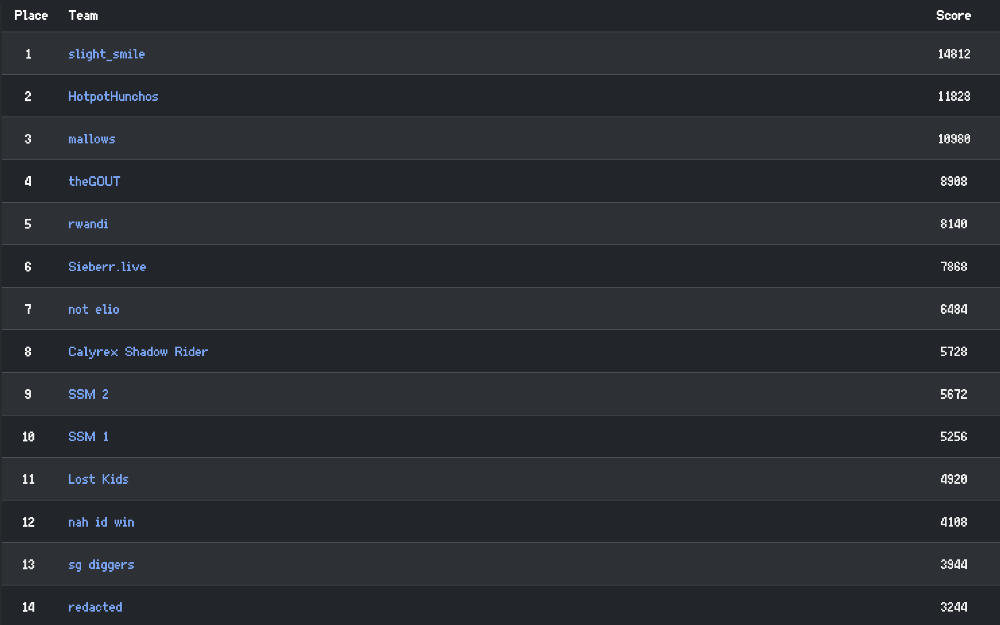

# Grey Cat The Flag 2025 - Writeups

**Team:** Lost Kids  
**University:** National University of Singapore  

This repository contains writeups and solution dumps for challenges we solved in Grey Cat the Flag 2025.

## Tournament Results

### Qualifiers (31 May - 1 June 2025)

- **Local Ranking:** 7th place
- **Overall Ranking:** 17th place

### Finals (28-29 June 2025)

- **Final Ranking:** 11th place out of 20 teams

## Challenge Writeups

### Qualifiers

#### Crypto

- [Idk](quals/crypto/idk/)
- [Shaker](quals/crypto/shaker/)
- [Uwusignatures](quals/crypto/uwusignatures/)

#### Ezpz

- [Tung Tung Tung Sahur](quals/ezpz/tung_tung_tung_sahur/)
- [Reversing 101](quals/ezpz/reversing_101/)
- [Oops](quals/ezpz/oops/)

#### Forensics

- [Layer Cake](quals/forensics/layer_cake/)
- [Notsus.Exe](quals/forensics/notsus/)

#### Misc

- [Countle Training Centre](quals/misc/countle_training_centre/)
- [Secret Development Kit](quals/misc/secret_development_kit/)

#### OSINT

- [A Walk In The Park](quals/osint/a_walk_in_the_park/)
- [By The Banana Tree](quals/osint/by_the_banana_tree/)
- [Red Flag Reconn](quals/osint/red_flag_reconn/)

#### Pwn

- [Infinite Connect Four](quals/pwn/infinite_connect_4/)

#### Rev

#### Web

- [Sgrpc](quals/web/sgrpc/)

### Finals

#### Blockchain

#### Crypto

#### Hardware

#### Misc

#### Pwn

#### Rev

#### Web

### Relevant websites

[CTFTime event](https://ctftime.org/event/2765/)

[NUS Greyhats](https://nusgreyhats.org/)
