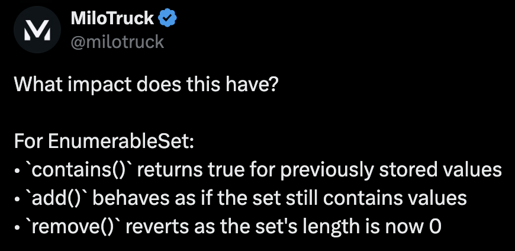

# Race

## Challenge (600 points, 11 solves)

> Ready, set, go!
>
> `nc challs3.nusgreyhats.org 34223`
>
> Author: MiloTruck

## Summary

A blockchain challenge exploiting a bug in the use of `EnumerableSet` in a race contract.

## Analysis

The contract uses `EnumerableSet` to track participants in. However, the contract used `delete races[raceId].players;` to clear the set, which is not the correct way to remove all elements from an `EnumerableSet`, as warned in the [OpenZeppelin documentation](https://docs.openzeppelin.com/contracts/5.x/api/utils#EnumerableSet).

In face, the author of this challenge even posted about this issue on [Twitter](https://x.com/milotruck/status/1669220764317548544):

## Approach

Create a new race, join once, and then repeatedly claim the payout to drain the contract's funds. The bug in `EnumerableSet` allows us to bypass the intended one-time payout restriction.

## Flag

`grey{cant_delete_mapping_c60126ce}`
