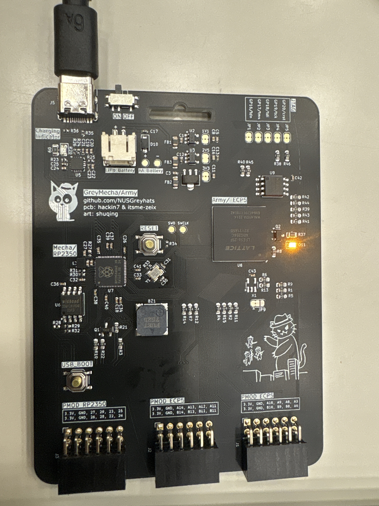

# Hornet Revenge

## Challenge (100 points, 20 solves)

> I want revenge.
>
> Stop the backend and run this in the Thonny REPL to start the challenge.
>
> `from hornet_revenge import *`
>
> Author: Hackin7

## Summary

This hardware challenge required interacting with a custom board using MicroPython in the Thonny REPL. The challenge was structured as a series of Q&A functions (`qna1()`, `qna2()`, `qna3()`, `qna4()`) that tested both hardware knowledge and hands-on skills with the board and its peripherals.

## Analysis

The questions covered:

- Identifying the MCU and FPGA on the board
- Understanding basic hardware concepts (PIO, FPGA, Verilog)
- Physically connecting pins on the board
- Communicating with the FPGA via UART to extract a key

## Approach

1. **Run the challenge:**
   - Connect the board, open Thonny, and run `from hornet_revenge import *`.

2. **Answer the questions in order:**
   - `qna1()` — Hardware theory questions:
     - What is the mcu of the device?: RP2350
     - What does the P in PIO stand for?: Programmable
     - What is an FPGA?: Field Programmable Gate Array
     - What are FPGAs 'coded' in?: Verilog
     - What is the FPGA chip on here?: LFE5U-25F-6BG256C
   - `qna2()` — Hardware interaction:
     - Connect GP27 of the RP to GND to continue.
   - `qna3()` — UART communication:
     - Initialize UART: `uart = busio.UART(tx=board.GP8, rx=board.GP9, baudrate=9600)`
     - Send: `uart.write(b"@---------------A@")`
     - Receive key: `key = uart.read(64)`
   - `qna4()` — Enter the key from previous step: `{hi_i'm_your_army}`

3. **Flag assembly:**
   - Each step reveals a part of the flag. Completing all steps gives the full flag.

## Flag

`grey{for_last_greyctf_i_was_holding_back...but_this_greyctf_i'm_no_longer_sleep_deprived}`
