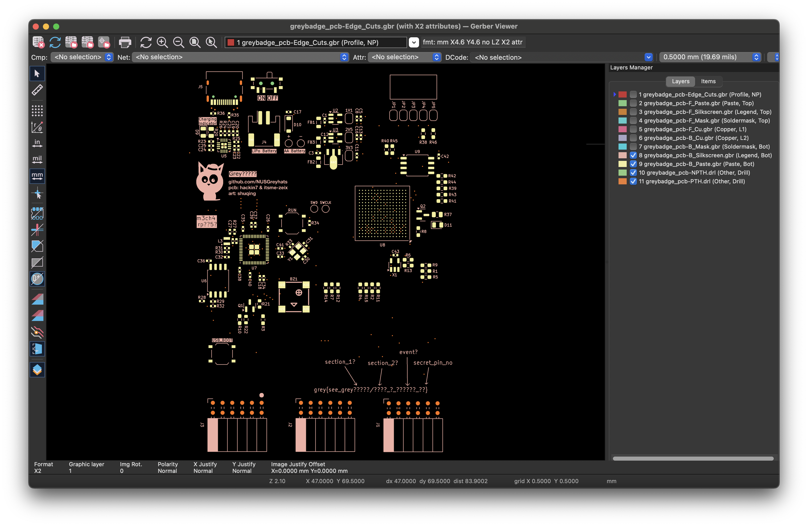
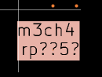
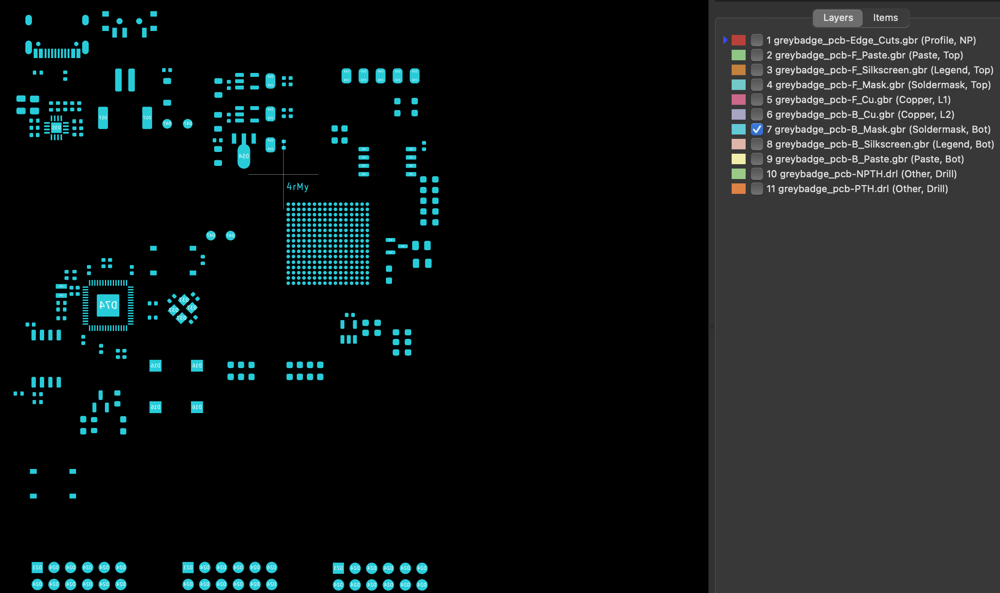
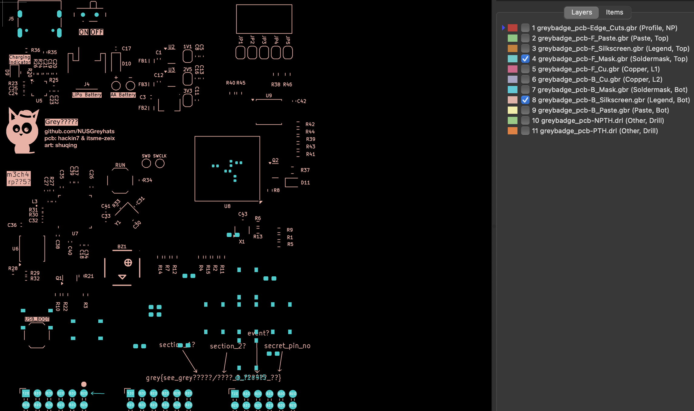
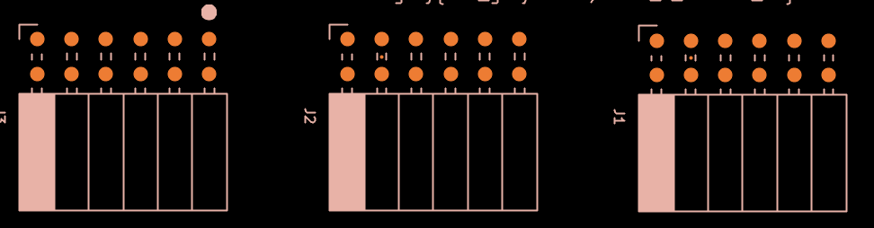

# Secret Development Kit

## Challenge (946 points, 38 solves)

> You have just stolen top secret production files of a secret board. Hmm, I wonder what it could be?
>
> Author: elijah5399

## Summary

We are given a bunch design files used for a printed circuit board (PCB).

## Analysis

Trying to read the files directly is not very useful since they are just coordinates and other information used to design the PCB. Need to download some specialized software such as KiCad to visualize the files.

## Approach

Open the files in KiCad and play around with the layers. We can see something like this:

To get the flag, we just need to find the values for these parts:

- section_1
- section_2
- event
- secret_pin_no

### section_1

There is only one part with 5 letters here:

### section_2

There is only one part with 4 letters here:

### event

Overlay these two layers and look for the text:

### secret_pin_no

The secret pin is highlighted here:

It is the first pin of the J3 part, while J1 and J2 part each have 12 pins. So the secret pin number is 25.

## Flag

`grey{see_greym3ch4/4rMy_@_f1n4l5_25}`
