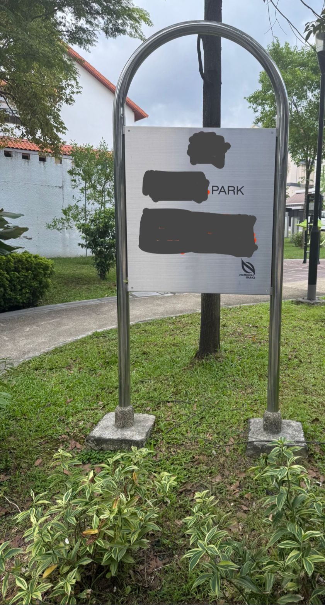
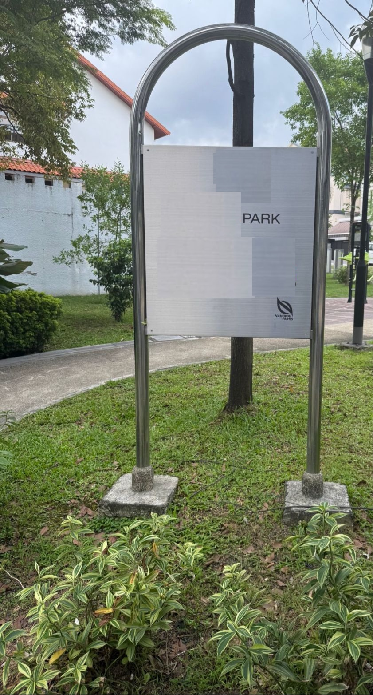
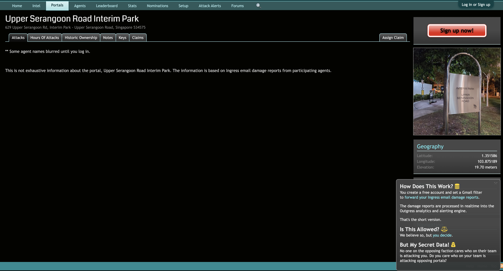

# A Walk In The Park

## Challenge (592 points, 102 solves)

> Warm up your OSINT skills with this challenge!
>
> You are given an image of a sign in the park.
>
> Submit the text on the sign as the flag in lowercase, converting all new lines and spaces to underscores.
>
> For example, if the sign looks like this:
>
> ABC PARK
>
> 123 Main St.
>
> Singapore
>
> Then, submit the flag as grey{abc_park_123_main_st_singapore}.
>
> Author: foobar

## Summary

Find the source of this image.

## Analysis

Google Image Reverse Search is the way to go. But we need to remove the artefacts to improve the search results.

## Approach

Edit the image to remove the artefacts like this:

Then, perform a Google Image Reverse Search on the edited image. This leads to this [website](https://outgress.com/portals/upper-serangoon-road-interim-park.3640457/):

## Flag

`grey{interim_park_upper_serangoon_road}`
